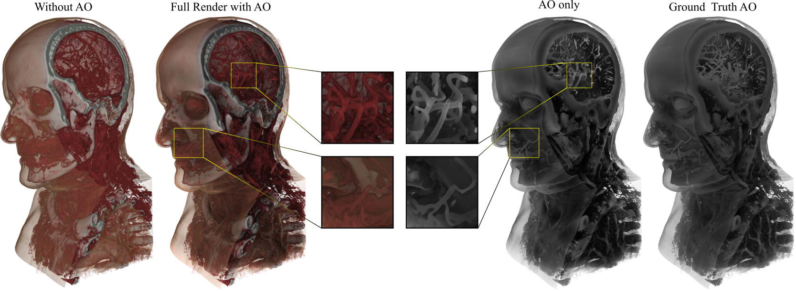

# Deep Volumetric Ambient Occlusion


This is the official PyTorch implementation of [DVAO](https://dominikengel.com/dvao).

### [Project Page](https://dominikengel.com/dvao)
### [Paper](https://ieeexplore.ieee.org/document/9222376)
### [Pre-Print (Open Access)](https://arxiv.org/abs/2008.08345)

If you find our work useful, please cite our paper:
```bibtex
@article{engel2020dvao,
  title={Deep Volumetric Ambient Occlusion},
  author={Engel, Dominik and Ropinski, Timo},
  journal={IEEE Transactions on Visualization and Computer Graphics},
  year={2020},
  doi={10.1109/TVCG.2020.3030344},
}
```

## Setup
### Docker
While you can setup the environment locally, we suggest using the Docker container (see `Dockerfile`) to run the training script.

### Local
You will need to install PyTorch >= 1.4 and NVIDIA's [Apex](https://github.com/nvidia/apex) for mixed precision. Since apex installation is often quite tricky locally, we suggest using the Docker container.

The commands below should setup your conda environment
```
conda create -n dvao python=3.6
conda activate dvao
conda install pytorch torchvision cudatoolkit=10.2 -c pytorch
git clone https://github.com/NVIDIA/apex.git
cd apex
pip install -v --no-cache-dir --global-option="--cpp_ext" --global-option="--cuda_ext" .
conda install -c conda-forge gdcm pydicom
pip install pytorch_lightning dicom_numpy scikit-image pillow pytorch-msssim
pip install git+https://github.com/aliutkus/torchinterp1d/tarball/master#egg=torchinterp1d
pip install git+https://github.com/aliutkus/torchsearchsorted/tarball/master#egg=torchsearchsorted
pip install git+https://github.com/lessw2020/Ranger-Deep-Learning-Optimizer@master#egg=ranger
```
Note that Python<=3.6 is required for `gdcm`. If you have prepared the dataset, you don't need gdcm anymore. Also using PyTorch >= 1.6 includes automatic mixed precision within PyTorch, so Apex is no longer needed.
It works without Apex on PyTorch=1.6 and PyTorch-Lightning=0.8.5.

### Compile CUDA script
If you want to use our scripts to generate the training data (or use the ground truth ray caster in any way), you need to compile the CUDA script yourself:
```bash
nvcc -Xcompiler -fPIC -Xcudafe --diag_suppress=esa_on_defaulted_function_ignored -shared -o raycast_volume.so raycast_volume.cu
```

## Usage
### Inference using pretrained model
First [download our weights](https://docs.google.com/uc?export=download&id=1MJ8AqKqR5Z9U3gsLpR_rJUAxfUevTVlI), then use our inference script:
```
python infer.py /path/to/checkpoint.ckpt /path/to/item
```
Check its code to see how to implement DVAO programmatically in your script.

### Train the model yourself
```
python train.py /path/to/ds
```
The default parameters should lead to the model we identify as best in our paper. See `python train.py --help` for possible parameters you might want to change.

To reproduce the run from the paper use `--seed 1871677067`.

### Training Data (CQ500)
The training data for DVAO uses the [CQ500 dataset](http://headctstudy.qure.ai/dataset) for CT volume data. The accompanying transfer function is randomly generated (see `tf_utils.py`) and the ground truth AO volume is computed using `raycast_cuda.py`.

After downloading the dataset, you can use the `cuda_runner.py` script to generate training data by first generating a random transfer function (TF), then computing the ground truth ambient occlusion volume using that TF and lastly saving it in the format that `QureDataset` can use (see `train.py`).

### Relevant Scripts and Files
```
Scripts with argparse arguments:
train.py            Training script for DVAO
infer.py            Inference script for DVAO
cunda_runner.py     Generates training data in the appropriate format
raycast_cuda.py     Computes ground truth AO

Additional Functions:
raycast_volume.cu   CUDA code for ground truth AO
Dockerfile          Dockerfile to setup our environment in a container
peak_finder.py      Used to extract histogram peaks for random TF generation
extract_peaks       Persistent Homology to extract histogram peaks. (from https://www.sthu.org/blog/13-perstopology-peakdetection/index.html)
utils.py            Utility functions
tf_utils.py         Functions used for our TF generation
ssim3d_torch.py     3D SSIM, adopted from https://github.com/VainF/pytorch-msssim
volume_loader.py    Utilities to load CQ500 in its original DICOM format
```
